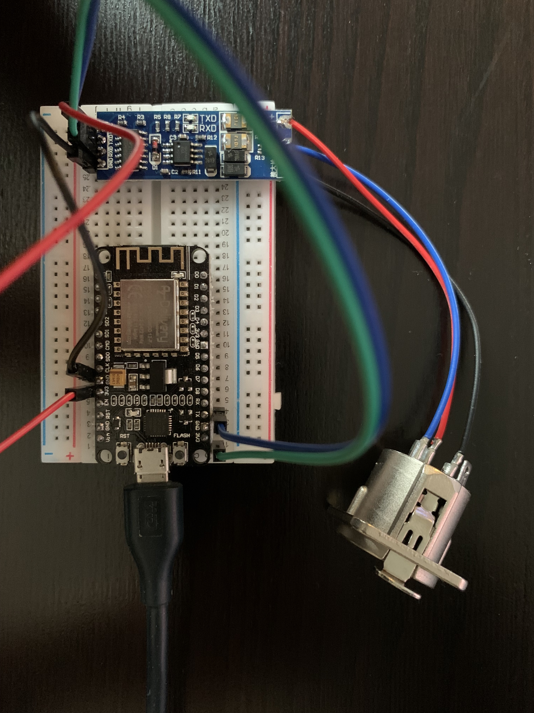

# esp8266_artnet_dmx
Use ESP8266 to receive ArtNet commands via WiFi and output them with TTL to RS485 converter.

I changed the code for outputing the DMX data within the onDmxFrame callback method from the example (rstephan/ArtnetnodeWifi). It's now done via the espDMX Library (mtongnz/espDMX) which produces more "stable" output and works when youre using a DMX Software which continously sends DMX Data at high frame rates. The code from the "ArtnetnodeWifi" example works when only a few frames are send per second. At higher framerates DMX lights start flickering and behaving weird ;).
\
Currently tested with two Par 56 RGB LED cans working stable for a runtime of 12 hours straight.

## This project uses the following Libraries / other Projects:
https://github.com/rstephan/ArtnetnodeWifi \
https://github.com/mtongnz/espDMX

## Hardware

### TTP223 Capacitive Touch Sensor (3,3V)
- https://www.instructables.com/Tutorial-for-TTP223-Touch-Sensor-Module-Capacitive/

### 0,96 Zoll monochrome I2C 128x64 OLED (3,3V)
- https://cdn.shopify.com/s/files/1/1509/1638/files/0_96_Zoll_Display_Datenblatt_AZ-Delivery_Vertriebs_GmbH_241c4223-c03f-4530-a8c0-f9ef2575872f.pdf?v=1622442722

### ARCELI TTL to RS485 Reziproke Converter
- https://www.amazon.de/ARCELI-Adapter-Serielle-Schnittstelle-Converter/dp/B07DN115BZ

### Wiring
D1 - I2C SCL  
D2 - I2C SDA  
D5 - Interrupt I/O from Touchbutton  
TX - TXD of ARCELI TTL to RS485  

### Hardware Setup
Note that the green wire connected to the RXD pin of the TTL to RS485 converter board is not conected to the ESP8266. It's plugged in to a free/empty rail of the breadboard. For only sending out DMX connecting only TX is sufficient (so the ESP may not get disturbed when randomly receiving something at RX).
Furthermore note that the RXD pin of this specific TTL to RS485 board has to be connected to TX pin of the ESP8266, TXD has to be connected to RX. When using other TTL to RS485 board the TX of the ESP may has to be connected to the RX pin of the TTL board.

